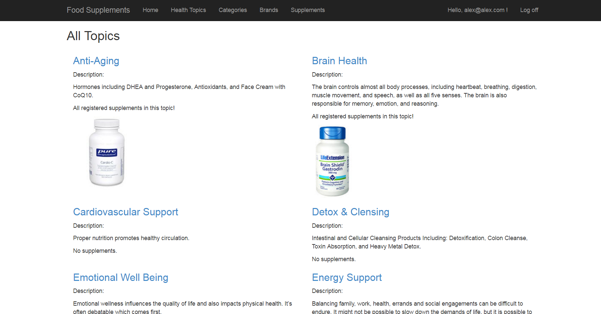
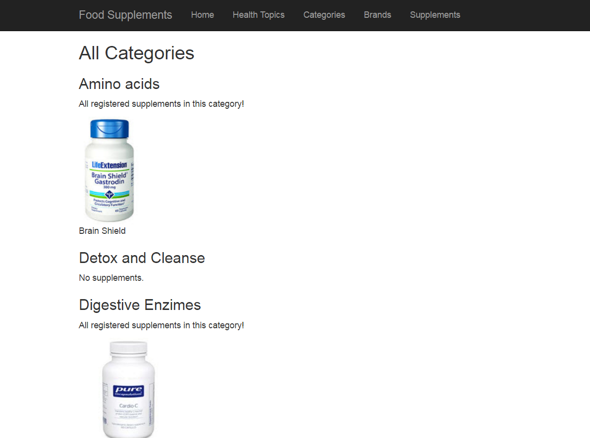
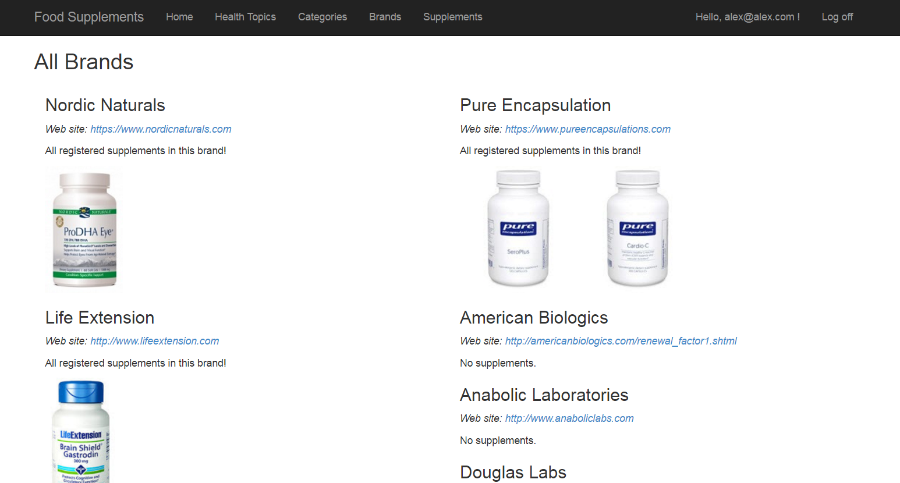
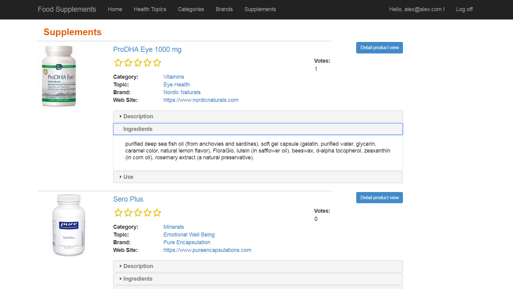
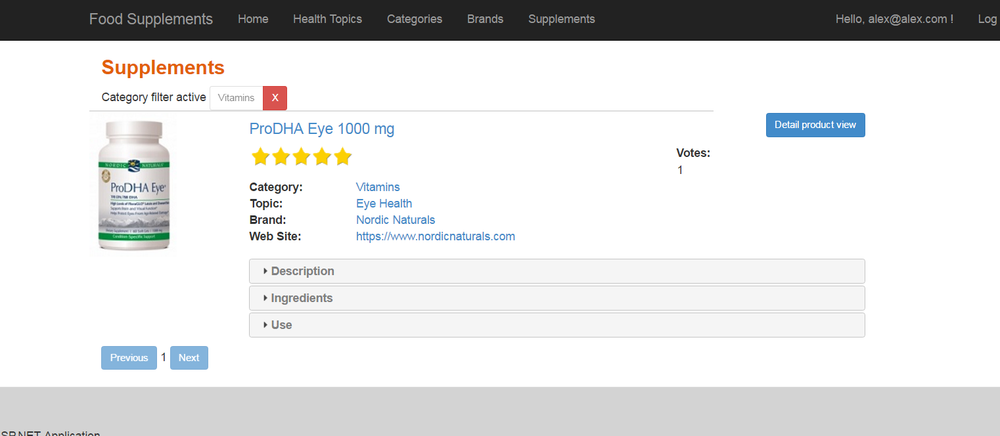

# FoodSupplementsSystem

 

##The be healty goal.

Nutrients, such as vitamins and minerals, are best derived from food sources. However, you might find it difficult to eat a balanced diet on a regular basis, especially if you have special food considerations, like allergies, that make certain items off-limits. 

Food supplements, also called dietary supplements can help you get the nutrients you lack from your regular diet. However, they're not intended to replace healthy meals and snacks. Consult with your doctor or registered dietitian before taking any food supplements.

##Screenshots

###The home page

 

###Health topicks

 

###On category pageyou can browse trough all categoies
 

###Or select by brands
 

###All supplements listed are to find here supplements
 

###And filtered
 

###And filtered again ;)
 

###Go to the detealed view, read all specks and vote
 

###Tree view menu makes it easy to navigate
 